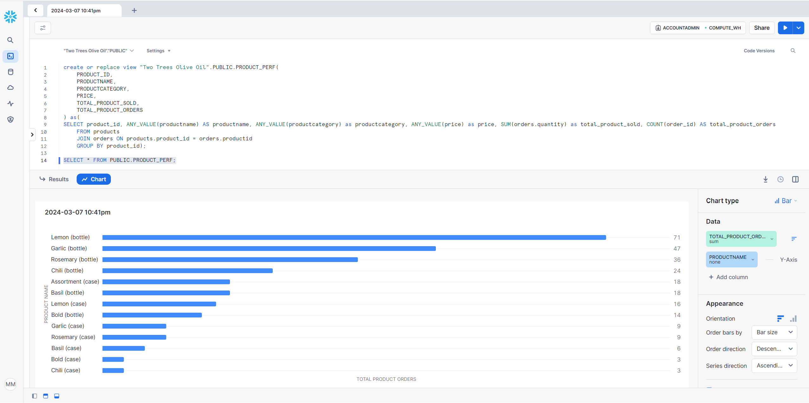

# Data Engineering

## **Table of Contents**

- [**Table of Contents**](#table-of-contents)
- [**Description**](#description)
- [**Usage**](#usage)
- [**Technologies Used**](#technologies-used)
- [**Preview**](#preview)
- [**Future Development**](#future-development)
- [**Questions**](#questions)

## **Description**

This project was designed as an academic learnig from the Linkedin course "Introduction to Analytics Engineering".

The learning of the course was the introduction to Data Engineering and the following concepts and tools:

* Data Modeling: Conceptual Modeling and Logical Modeling.
* Cloud Data Warehouses such as: Snowflake.
* DBT (Data Building Tool).
* BI (Business Intelligence Tools) such as Looker. 
* SQL queries.
* ETL(Extract, Transform, Load Data).
* Data Aggregation.
* Documentation.

Challenge: A View was created with a SQL query were tables were joined and aggregate functions were implemented as required.

## **Usage**

The View was implemented using Snowflake.

## **Technologies Used**

* SQL
* Snowflake
  
## **Preview**

* **Snowflake**

## **Future Development**

* Implement additional advance queries.

## **Questions**

* Contact me on my GitHub profile: [Marcela's GitHub](https://github.com/marcelamejiao)
